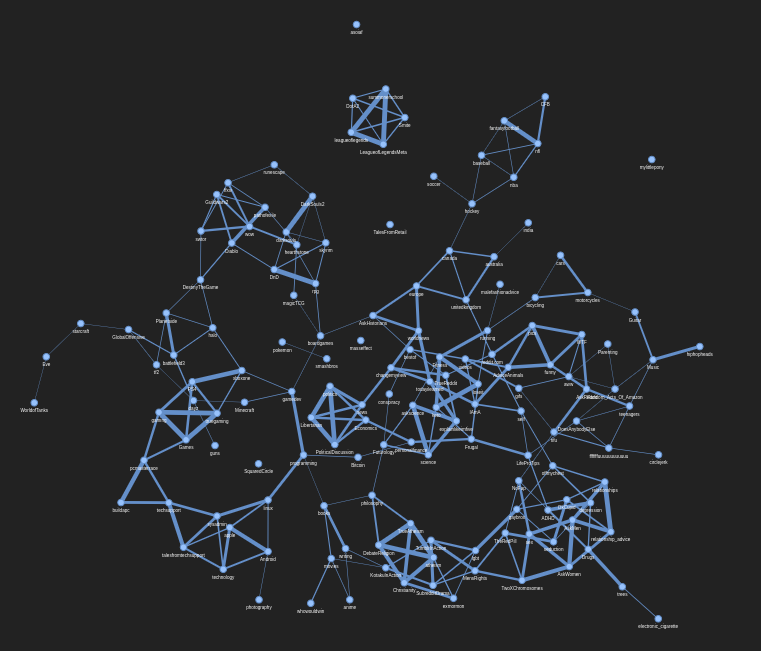
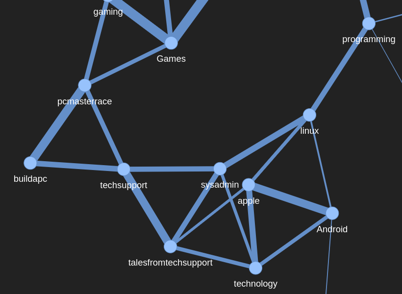
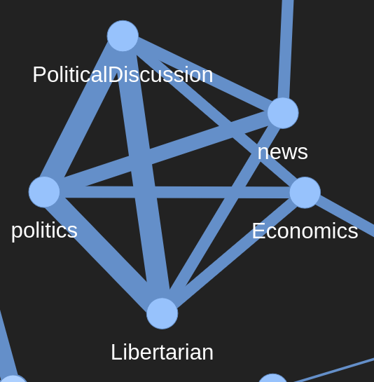
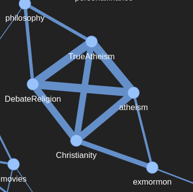
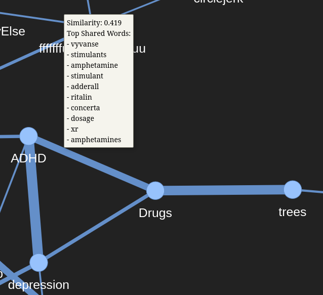
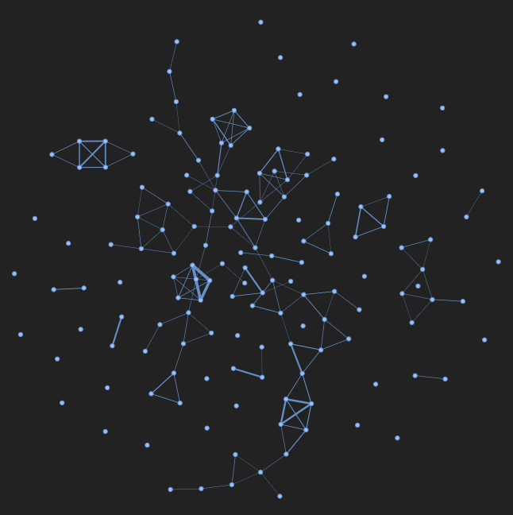
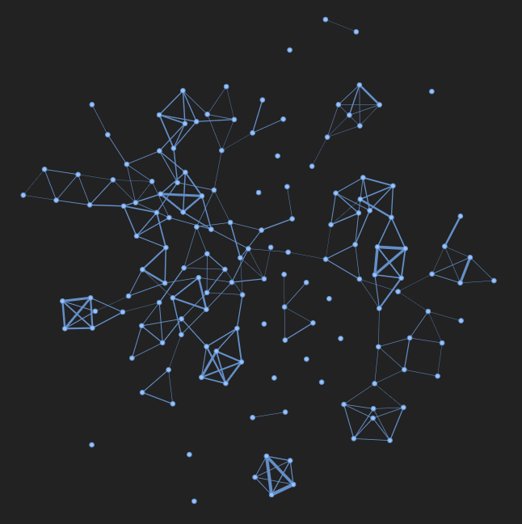
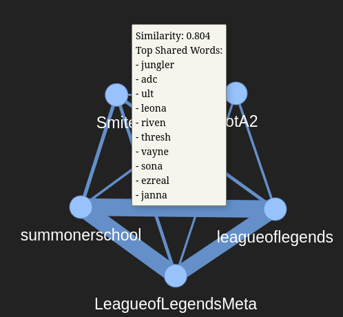
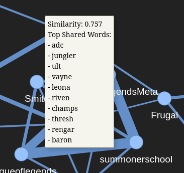

# A Map of Reddit, Drawn from Words
_Group members: [Lucas Cimerman], [Lukas Mauz], [Roman Lohmiller]_

Reddit is a platform composed of diverse, distinct communities, allowing users to join and participate in multiple groups simultaneously. To analyze the composition of these so-called subreddits, we wanted to draw a graphical map based on the similarity in language used on them.

Our idea is simple. r/leagueoflegends and r/DotA2 should sit close together, because they talk about the same things: lanes, cooldowns, patches. r/personalfinance and r/wallstreetbets share a vocabulary too, even if the tone is different. If that intuition holds, then the words alone should be enough to reconstruct the structure of Reddit based solely language.

## Introduction

The base idea is simple; we encode the language used in each subreddit as a vector of numbers and compare them using cosine similarity. 

## Dataset

We use the [Webis TLDR-17 corpus](https://huggingface.co/datasets/webis/tldr-17), a collection of roughly 3.8 million Reddit posts, each paired with an author-written TL;DR. It was originally built for summarization, but as the summaries are irrelevant to us, we discard them and all other fields but `body` and `subreddit`.

The corpus is heavily skewed. A handful of large subreddits contribute most of the posts, and a long tail contributes very little. Estimating a stable vocabulary for a subreddit with fifty posts is hopeless, so we restrict ourselves to the **top 300 subreddits by post count**. This keeps the communities with enough text to have a recognisable "voice".

## Methods

### Setup
We used a python 3.14.5 virtual environment to run our code on a laptop running Fedora Linux 44 (Kernel 7.0.11) with an AMD Ryzen 5500U and 16GB RAM.

Creating and entering the virtual environment:
```bash
python -m venv .venv
source .venv/bin/activate
```

All python dependencies are listed in the `requirements.txt` and can be installed using 
```bash
pip install -r requirements.txt
``` 

The pipeline splits into two stages. Running
```bash
python mine_tokens.py
```
does the expensive one-time work of calculating the subreddit specific word frequencies and saves the result to a file.


```bash
streamlit run netvis.py
```
opens a Streamlit app that loads the word frequency file and builds the graph live, in which the pre filtering and similarity matrix options can be adjusted.

### Vocabulary Building

For each of the top 300 subreddits we tokenize every post body with NLTK's `TweetTokenizer`, chosen over a plain word tokenizer because Reddit text is closer to tweets than to prose: casual, full of contractions, elongated words ("soooo"), and mentions. We lowercase everything, collapse repeated characters, strip handles, and keep only alphabetic tokens (allowing apostrophes, so "don't" survives).

This gives us the term frequencies for each subreddit, i.e. its raw vocabulary representation. We drop very rare words with a tiny relevance cutoff to get rid of outliers and typos.

### Graph Generation Pipeline 

To allow for flexible data exploration, we created a graphical interface to easily adjust important parameters. The pipeline can be split up into five parts:

**1. Filtering:** 
Some words are useless for telling communities apart. Function words like "the" and "and" appear everywhere, so we optionally remove standard English words using NLTK's word list using the option *Remove Standard English Words*.
We also drop words that appear in more than a set percentage of all subreddits (e.g. 80%). Increasing this threshold keeps more common words, while decreasing the threshold removes most shared words such that only highly specific words remain. Finally we keep only the subreddits N (e.g. 100) most relevant words for further processing. This method gives us a word vector with words that are fairly common between some subreddits, but do not appear in most subreddits, which we can use to compare the language used in the subreddits.

**2. Representation:** We implemented three different featurization options:

- *Raw counts*; as the baseline, where the total number of occurences of a word in each subreddit is encoded. This does not take into account the size of the subreddits text data.
- *Relevance*; each count divided by the subreddit's total word count, so big subreddits don't dominate. We also added an additional filter to only keep words with a minimum relevance score that can be adjusted, such that exremely rare words that do not really represent the subreddits language get filtered out (primarily useful when keeping a lot of words per subreddit, to only keep the words with a high relevance).
- *TF-IDF*; down-weights words common across many subreddits and up-weights the distinctive ones.

**3. Dimensionality reduction:** Optionally we apply Latent Semantic Analysis to project the sparse term matrix down to at most 100 components, yielding higher similarity scores for semantically similar subreddits.

**4. Similarity calculation:** Whatever the representation, we compute the cosine similarity between every pair of subreddits, giving a similarity matrix.


**5. Graph construction and analysis:** To construct the graph, we draw an edge between two subreddits when their similarity clears a threshold. To eliminate clutter created by highly connective subreddits, we implemented an upper limit for node degrees.The result is rendered with Pyvis, so you can drag nodes around, hover a node to see its top words, and hover an edge to see the words two subreddits share. This allows for a highly interactive exploration of the resulting graph and facilitates an easy comparation between the pipelines options to find differences and similarities between the implemented possible options. Additionally, we also implemented three graph analysis methods that calculate different matrics for the resulting graph:
- *Language Communities:* This method aims at finting clusters with high connectiveness in the graph. Depenging on the paramteters, this usually returns clusters with shared topics, such as Gaming (DestinyTheGame, Diablo, DnD, DotA2, Eve, Games, GlobalOffensive, Guildwars2) or Relationships (AskMen, AskReddit, AskWomen, OkCupid, TwoXChromosomes, relationship_advice, relationships, sex).
- *Language Translators:* This method finds subreddits that act as bridges between subreddits. These subreddits have similar vocabulary to many other subreddits which are not strongly connteced to each other.
- *Isolated Subreddits:* These subreddits are the ones which have the lowest maximum similarity to all other subreddits.
 
## Results and Discussion

### Exploring the Graph
The interactive App can be used to explore different settings and the resulting graphs. Using the default settings we chose, the resulting graph looks like this:


We can easily find many clusters that intuitively make sense, such as the tech cluster:


or the politics cluster:


or the religion cluster:
 

Most connections in the graph make sense intuitively, and the edges can be inspected showing the top shared words between the subreddit. For example, ADHD and Drugs both seem to commonly talk about ADHD medication which seem to commonly be absused as drugs:


### Exploring parameter settings
We discovered that even slight changes of some paramters can cause vastly different looking graphs. For example changing the similarity theshold from the default 0.07 to slightly higher values results in a way less connected graph and many isolated nodes, showing that most of the similarity scores are rather small, while some parameters such as keep top N words have a smaller impact on the resulting graph and usually only slightly change the similarity scores between subreddits.

The max subreddit apprearance parameter also has a high impact on most of the graph, where an decrease in allowed subreddit appearance (= filtering out more of the common shared words) quickly leads to a highly disconnected graph when not adjusting the other parameters. Interestingly in this scenario, we can see that some highly specific clusters (like the League of Legends / Smite / Dota cluster) still stay connected, because they have a really large vocabulary of unique words (e.g. champion names, specific gaming terms like "ult", "gank", or "laning" which do not get filtered out even with the higher filtering settings), while more general connections get removed rather quickly.

   


We also investigated the difference between the different featurization methods (raw word count, relevance, tf-idf) and concluded that while there are slight differences, the general appearance of the graph stays mostly the same. Also, not using latent semantic analysis to reduce the number of dimensions generally decreases similarity scores and connectedness of the graph, but this can be counteracted by decreasing the similarity threshold as well.

Overall, we conclude that any of the featurization methods can yield interesting and meaningful results, if the parameters are tuned accordingly. 

